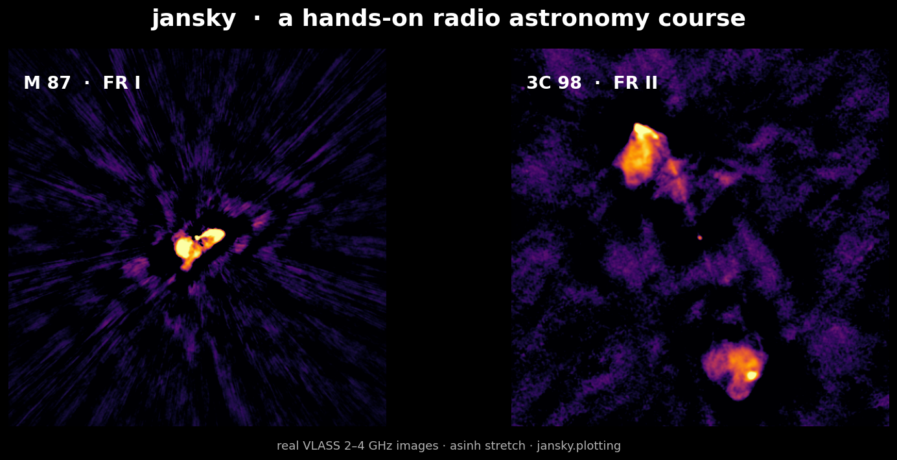

# jansky

[](https://github.com/joebarbere/jansky/actions/workflows/ci.yml)
[](https://joebarbere.github.io/jansky/)



<sub>Real VLASS 2–4 GHz images of M87 (FR I) and 3C 98 (FR II), made with the course's own
`jansky.plotting` toolkit (Chapter 46).</sub>

**A hands-on radio astronomy course in Python** — from *"what is a radio wave from space?"*
to *downloading real telescope data and doing original analysis*.

Named after [Karl Jansky](https://en.wikipedia.org/wiki/Karl_Guthe_Jansky), who in 1932
discovered radio emission from the Milky Way (and after whom the unit of radio brightness,
the **jansky**, is named), this course teaches the fundamentals of radio astronomy through
executable Jupyter notebooks that mix prose, the physics (with equations), runnable code,
and plots — each chapter citing the seminal papers so you can read the originals.

Every chapter uses the real libraries working astronomers use — `astropy`, `astroquery`,
`spectral-cube`, CASA, PINT — so you build transferable skills, not toy ones.

📖 **Read the course online:** <https://joebarbere.github.io/jansky/> — the full site with
every notebook, the bibliography, glossary, and telescope/papers references rendered in-browser.
New to it? The **[Start Here](https://joebarbere.github.io/jansky/start-here/)** page helps you
pick a track (laptop-only, RTL-SDR, interferometry, transients, or just the physics).

## Quickstart

### Local (recommended)

```bash
# Install uv: https://docs.astral.sh/uv/
curl -LsSf https://astral.sh/uv/install.sh | sh

git clone https://github.com/joebarbere/jansky.git
cd jansky
uv sync                 # creates the env, pins Python 3.12
uv run jupyter lab      # open notebooks/01_what_is_radio_astronomy.ipynb
```

### Containers (podman or docker)

```bash
podman compose -f containers/compose.yaml up lab     # JupyterLab at http://localhost:8888
```

Heavy, chapter-specific tools live in their own images behind compose profiles
(`--profile interferometry` for CASA, `--profile sdr` for GNU Radio). See
[docs/setup.md](docs/setup.md) for details.

## The course map

**41 chapters** in four parts, plus a six-part Maths Lab appendix (47 executable notebooks in
all). **Chapter numbers are stable IDs**, assigned in the order chapters were written — like
catalogue numbers they never change, so links stay valid. Read **by theme, in the order below**
(not by number); the [learning paths](https://joebarbere.github.io/jansky/learning-paths/) page
maps the prerequisites and themed routes.

| # | Chapter | Highlights |
|---|---------|-----------|
| **Part I — Foundations** ||
| 1 | What is Radio Astronomy? | Jansky & Reber; the jansky unit; the atmospheric window |
| 2 | The Physics of Radio Emission | Rayleigh–Jeans, brightness temperature, spectral index |
| 3 | Signals, Noise & the Radiometer Equation | Dicke 1946; watch a signal climb out of the noise |
| 43 | Synchrotron Radiation | α = −(p−1)/2; SSA turnover; spectral aging; equipartition field |
| 44 | Free-Free Radiation & HII Regions | the emission measure; the thick→thin turnover; Strömgren sphere |
| **Part II — Instrumentation & Hardware** ||
| 4 | Antennas & Receivers | beam patterns, 1.22 λ/D resolution, A_eff, SEFD |
| 5 | Hands-on SDR *(optional)* | RTL-SDR, sampling, IQ data, power spectra |
| 6 | Detecting the Hydrogen Line | the 21 cm line; van de Hulst, Ewen & Purcell |
| 26 | Meteor Scatter & Passive Radar | forward scatter, echo counting, bistatic radar |
| 27 | VLF & the Ionosphere *(SuperSID)* | detect solar flares as sudden ionospheric disturbances |
| 28 | GNU Radio Flowgraphs | a radiometer & spectrometer as DSP blocks; export to SigMF/GUPPI |
| 29 | No-Hardware HI: VIRGO & PICTOR | reduce an online hydrogen-line observation |
| 30 | RASDR & Radio-Sky Spectrograph | stream over the RSS TCP protocol |
| 40 | Lightning as a Radio Source | sferics, tweeks, whistlers; time-of-arrival geolocation |
| **Part III — Interferometry & Imaging** ||
| 7 | Why Interferometry? | two-element fringes; resolution from baselines |
| 8 | Aperture Synthesis & the uv-plane | van Cittert–Zernike; Earth-rotation synthesis; the dirty beam |
| 9 | Deconvolution & CLEAN | Högbom 1974, implemented by hand |
| 41 | Practical Calibration | gain/bandpass/phase solutions; closure; self-calibration |
| 17 | Coherent Interferometry *(KrakenSDR)* | phase coherence, calibration, recovering a direction |
| 19 | The EHT & VLBI | µas resolution; closure phase/amplitude; imaging a black-hole ring |
| 25 | Intensity Interferometry *(HBT)* | correlate intensity, not phase; recover an angular size |
| 37 | Polarisation & Faraday Rotation | Stokes parameters; the λ² law; RM synthesis |
| **Part IV — Real Data & Research** ||
| 10 | Accessing Open Archives | astroquery / pyvo against NRAO, HEASARC, VizieR, the VO |
| 11 | HI 21 cm & Galactic Rotation | derive a rotation curve → the dark-matter problem |
| 12 | Continuum Imaging with the VLA | calibrate & image a real MS in CASA |
| 13 | Pulsars | Hewish & Bell 1968; dispersion, de-dispersion, folding |
| 14 | Multi-wavelength Diversion | cross-match radio with Gaia/SDSS; build an SED |
| 15 | Capstone | an open-ended mini research project |
| 16 | Data Formats & the Ecosystem | GUPPI, SigMF, the Radio-Sky protocol; SETI tools |
| 18 | Fast Radio Bursts | the DM search "butterfly"; matched filtering; the Macquart relation |
| 20 | Pulsar Timing Arrays | the Hellings–Downs curve; the nanohertz GW background |
| 21 | SETI | the Doppler-drift search; ON/OFF cadence; the Drake equation |
| 22 | The Cosmic Microwave Background | the 2.725 K blackbody; the dipole; anisotropy |
| 23 | Solar & Jupiter Radio Astronomy | a type-II burst → CME shock speed; Jovian decametric emission |
| 24 | Molecular Lines & Masers | the CO ladder; weighing the NGC 4258 black hole |
| 38 | Machine Learning in Radio Astronomy | FRB/RFI classification; a learned classifier vs the matched filter |
| 39 | RFI Mitigation in Practice | robust statistics; spectral kurtosis; the SumThreshold algorithm |
| 42 | Cosmic Dawn & the Epoch of Reionization | the redshifted 21 cm signal; the global trough; foreground removal |
| 45 | Radio Galaxies, AGN & Source Counts | FR I/II morphology; the radio luminosity function; log N–log S |
| 46 | The Art of Radio Images | colormaps, the asinh stretch, dynamic range, all-sky projections — and the hero above |
| 47 | Long-Period Radio Transients | the P–Ṗ diagram & death line; epoch-folding period search; white-dwarf-binary LPTs |
| **Appendices — Maths Lab** ||
| A–F (31–36) | Fourier & convolution · matched filtering · noise & RFI · coordinates & time · calibration linear algebra · special functions | worked, executable maths behind the chapters |

Optional hardware chapters have simulated/archival fallbacks, and every research chapter
degrades gracefully to offline synthetic data — so you can complete the **entire** course with
nothing but a laptop and no network.

## What's in the box

```
jansky/
├── notebooks/        # the course — 41 executable chapters + a six-part Maths Lab (47 in all)
├── docs/             # MkDocs site: notebooks rendered, plus a deep reference library
│   ├── glossary · notation · math-preliminaries · data-formats   # learn-the-craft pages
│   ├── projects · field-notes · videos · visual-tour             # build & watch
│   ├── telescopes (+ assets/telescopes.kml) · resources · mastodon
│   └── references · papers-timeline                              # the literature
├── src/jansky/       # the helper package the notebooks lean on
│   ├── units · signals · interferometry · data · plotting        # core (plotting = the viz toolkit)
│   ├── formats        # GUPPI, SigMF, the Radio-Sky Spectrograph protocol
│   ├── synchrotron · freefree · sourcecounts                     # continuum emission & the radio sky
│   ├── transients · timing · seti · solar · molecular · eor      # the science modules
│   ├── polarization · lightning · meteor · vlf                   # polarimetry & amateur-observing sims
│   ├── rfi            # robust statistics & spectral-kurtosis flagging
│   └── mastodon_reader  # read the community's posts (+ optional TUI, --extra tui)
├── scripts/          # generate_figures.py · dataset_watch.py (watch the archives)
├── containers/       # Dockerfiles + compose (JupyterLab, CASA, GNU Radio)
├── tests/            # pytest for every helper module; nbmake smoke-tests
├── plans/            # delivered-status records of the expansion plans
└── .claude/          # research tooling for Claude Code
    ├── agents/       # subagents: notebook-author, science-reviewer,
    │                 #   radio-research-assistant, archive-scout
    └── skills/       # radio-mastodon · dataset-watch · find-radio-papers · radio-source-lookup
```

### Research helpers (Claude Code)

Working in this repo with [Claude Code](https://claude.com/claude-code)? It ships **skills** and
**agents** for radio-astronomy research: read/search the community feed (`radio-mastodon`), check
the archives for new data or preprints (`dataset-watch`), find papers (`find-radio-papers`), look
up a source across catalogues (`radio-source-lookup`), and two research subagents
(`radio-research-assistant`, `archive-scout`).

## Common tasks

```bash
make help            # list all targets
make lab             # JupyterLab
make docs-serve      # live docs at http://localhost:8000
make test            # unit tests
make test-notebooks  # execute the Part I notebooks end-to-end
make fetch-data      # list sample datasets (ARGS="--fetch hi4pi-sample" to download)
make mastodon        # read the listed astronomers' Mastodon posts (TUI; needs --extra tui)
```

## Going deeper

Beyond the chapters, the docs site is a reference library in its own right:

- **Learn the craft** — [Glossary](docs/glossary.md), [Reading the Notation](docs/notation.md),
  [Mathematical Preliminaries](docs/math-preliminaries.md), [Data Formats](docs/data-formats.md).
- **The literature** — the [References](docs/references.md) bibliography (Jansky 1933, Ewen &
  Purcell 1951, Högbom 1974, Hewish & Bell 1968, …) and a year-by-year
  [timeline of landmark papers](docs/papers-timeline.md).
- **Go observe** — [Projects, Kits & Hacks](docs/projects.md), [Field Notes](docs/field-notes.md),
  the [Radio Telescopes catalogue](docs/telescopes.md) (with a Google Earth
  [`telescopes.kml`](docs/assets/telescopes.kml)), [Watch on YouTube](docs/videos.md), and the
  [community on Mastodon](docs/mastodon.md).

Above all, Condon & Ransom's free [*Essential Radio Astronomy*](https://science.nrao.edu/opportunities/courses/era)
is the perfect companion to this course.

## From learning to doing — the research sibling

Once you've worked through the chapters, see **[`jansky-research`](https://github.com/joebarbere/jansky-research)**:
a sibling repo that *depends on this course as a library* and crosses from learning into **original,
reproducible amateur research** — one gap → one tested tool (reusing jansky's helpers) → real public
data → an honest AASTeX paper. It's the worked example of the Part IV "Real Data & Research" track at
full scale (validations and honest negatives alike), with an Airflow-on-Podman reproducibility layer.

## License

MIT — see [LICENSE](LICENSE).
