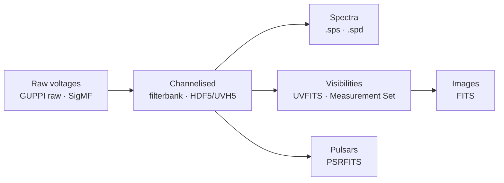

# Data Formats & the Ecosystem

Radio data passes through a chain of formats on its way from antenna to result:
raw voltages → channelised spectra → calibrated visibilities → images. Knowing the formats —
and the tools that read them — is half of practical radio astronomy. This page is the reference
behind [**Chapter 16**](notebooks/16_data_formats_and_ecosystem.ipynb) and the [`jansky.formats`](https://github.com/joebarbere/jansky/blob/main/src/jansky/formats.py)
helper module.



## The format landscape

| Format | What it holds | Produced by | Read with | Spec / reference |
|---|---|---|---|---|
| **GUPPI raw** (`.raw`) | Raw complex voltages, 8-bit, `[chan][time][pol]` | Green Bank / Breakthrough Listen backends | `jansky.formats`, `blimpy` | [Estévez: writing GUPPI with GNU Radio](https://destevez.net/2022/08/writing-guppi-files-with-gnu-radio-and-using-seti-tools/) |
| **SIGPROC filterbank** (`.fil`) / **HDF5** | Channelised power (waterfall) | `rawspec`, pulsar/FRB backends | `blimpy` | SIGPROC / Breakthrough Listen |
| **PSRFITS** | Folded/search-mode pulsar data | pulsar backends | `astropy.io.fits`, `your`, PSRCHIVE | PSRFITS standard *(see Ch 13)* |
| **Measurement Set** (MS) | Calibrated interferometer visibilities | CASA | CASA, `pyuvdata` | casacore *(see Ch 12)* |
| **UVFITS / UVH5** | Visibilities (interchange) | correlators, `pyuvdata` | `pyuvdata` | [RASG / pyuvdata](https://radioastronomysoftwaregroup.github.io/) |
| **SigMF** (`.sigmf-meta` + `.sigmf-data`) | SDR recordings: JSON metadata + raw samples | any SDR | `jansky.formats`, `sigmf` | [sigmf.org](https://sigmf.org/) |
| **SPS** (`.sps`) | Radio-Sky Spectrograph spectra | Radio-Sky Spectrograph / Radio JOVE | *(reader deferred — see below)* | [Radio JOVE](https://radiojove.gsfc.nasa.gov/) · [data: radiojove.net](https://radiojove.net/) |
| **SPD** (`.spd`) | Radio-SkyPipe strip-chart | Radio-SkyPipe | *(reader deferred)* | [radiosky.com](https://www.radiosky.com/skypipeishere.html) |

!!! tip "Where to find SkyPipe / SPS data"
    Actual `.spd`/`.sps` observations live in the **Radio JOVE Data Archive** ([radiojove.net](https://radiojove.net/))
    and the **MASER/VESPA** collection at Paris Observatory — see the
    [Amateur & Radio JOVE / SkyPipe data](resources.md#amateur-radio-jove-skypipe-data) table in Resources.

## Using `jansky.formats`

The helper module implements the formats we can follow to a public specification, and is honest
about the ones we cannot yet verify byte-for-byte.

### GUPPI raw

```python
from jansky import formats
import numpy as np

volts = (np.random.randint(-20, 20, (4, 16, 2))        # (nchan, ntime, npol)
         + 1j*np.random.randint(-20, 20, (4, 16, 2)))
formats.write_guppi("demo.0000.raw", volts, header={"OBSFREQ": 1420.0, "TBIN": 1e-6})

header = formats.read_guppi_header("demo.0000.raw")     # parse the ASCII cards
for hdr, block in formats.iter_guppi_blocks("demo.0000.raw"):
    ...                                                 # block: complex (nchan, ntime, npol)
```

The header is a stack of 80-byte ASCII cards (`KEYWORD = value`, FITS-like) ending in `END`,
followed by `BLOCSIZE` bytes of interleaved int8 I/Q ordered `[channel][time][polarisation]`.
Run `rawspec` to reduce raw → filterbank, then `turboSETI` (the `seti` extra) for a Doppler-drift
search — the Breakthrough Listen pipeline.

### SigMF (portable SDR recordings)

```python
formats.write_sigmf("capture", samples, sample_rate=2.4e6, center_freq=1.42e9)
samples, meta = formats.read_sigmf("capture")
```

### Talking to Radio-Sky Spectrograph over the network

Radio-Sky Spectrograph (RSS) accepts a live TCP feed — the same path
[RASDR](https://github.com/myriadrf/RASDR) uses. The protocol (documented in
["How to Talk to Radio-Sky Spectrograph"](http://cygnusa.blogspot.com/2015/07/how-to-talk-to-radio-sky-spectrograph.html)
and the [RASDR socket commit](https://github.com/myriadrf/RASDR/commit/61676c46aee677ad215d5187084a92b41269834f)):
RSS listens on **127.0.0.1:8888**; the client sends an ASCII config
`F <Hz>|S <Hz>|O <Hz>|C <nchan>|`, then streams each sweep as `nchan` little-endian
("LoHi") `uint16` samples (12-bit data), **highest channel first**, ending each sweep with the
terminator bytes `0xFE 0xFE`. No timestamps, no acknowledgements.

`jansky.formats` ships both a client and an in-process **mock server**, so you can exercise the
full wire format with nothing installed:

```python
server = formats.MockRSSServer(); server.start()
with formats.RSSClient(center_hz=21_000_000, bandwidth_hz=5_000_000,
                       n_channels=256, host=server.host, port=server.port) as rss:
    for sweep in spectra:          # each: 256 channel powers
        rss.send_sweep(sweep)
server.join()
assert server.config["C"] == 256   # the decoded sweeps are in server.sweeps
```

To feed the real application instead, point `RSSClient` at `127.0.0.1:8888` with RSS running and
its **Options → Radio → RTL Bridge/TCP** input selected.

!!! note "SPS / SPD readers are deferred — on purpose"
    The authoritative `.sps` (Typinski 2015) and `.spd` binary layouts were not
    machine-readable when this module was written, and we don't guess binary formats.
    `formats.read_sps()` / `read_spd()` raise `NotImplementedError` with a pointer; for live
    Radio-Sky data use the RSS protocol above. Implementing the file readers from a verified spec
    is tracked in [`plans/04-data-formats-and-seti-software.md`](https://github.com/joebarbere/jansky/blob/main/plans/04-data-formats-and-seti-software.md).

## The wider ecosystem

- **[RASG — Radio Astronomy Software Group](https://radioastronomysoftwaregroup.github.io/)** —
  `pyuvdata` (visibility interchange: MS ↔ UVFITS ↔ UVH5), `pyradiosky`, and RFI tooling. Install
  the `formats` extra (`uv sync --extra formats`) for `pyuvdata`.
- **Breakthrough Listen / SETI** — `blimpy` (filterbank/HDF5 I/O), `rawspec`, `turboSETI`
  (`seti` extra). See [Chapter 16](notebooks/16_data_formats_and_ecosystem.ipynb) and the SETI material in [Field Notes](field-notes.md).
- **[VIRGO](https://virgo.readthedocs.io/)** — a single-dish HI/continuum package (the engine
  behind [PICTOR](https://pictortelescope.com/)); install the `hi` extra. A zero-hardware route to
  a real hydrogen-line observation, complementing [Chapter 6](notebooks/06_hydrogen_line.ipynb).
- **CASA** — calibration & imaging of Measurement Sets; already covered in
  [Chapter 12](notebooks/12_vla_imaging.ipynb) and [Resources](resources.md).

## Bundled real starter datasets

So you can work with *real bytes* — not just simulation — `jansky.data` registers a handful of
small (< 2 MB) real files served from stable raw-GitHub URLs, cached on first use into `data/`:

```bash
python -m jansky.data --list                     # see them all (small first, then opt-in large)
python -m jansky.data --fetch pint-ngc6440e-par  # download one
```

The starter set includes a real search-mode **PSRFITS** and **SIGPROC filterbank** (from the
[`your`](https://github.com/thepetabyteproject/your) test suite) and the real **NANOGrav timing
model + TOAs** for PSR J1748−2021E in NGC 6440 (`NGC6440E.par`/`.tim`, the
[PINT](https://github.com/nanograv/PINT) example). The 576 MB HI4PI all-sky map is kept as an
opt-in `"large"` entry, off the default path; offline, `jansky.data.synthetic_hi_cube()` stands
in. Every URL is checked by `scripts/check_dataset_urls.py`.

See also: [Projects, Kits & Hacks](projects.md) for the hardware that produces these files, and
the [Bibliography](references.md) for the science.
