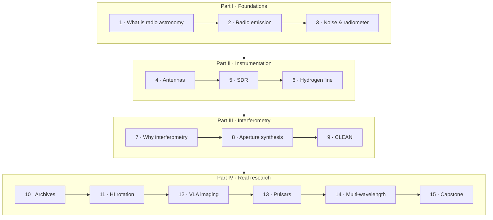

# jansky

**A hands-on radio astronomy course in Python.**

In 1932, a young Bell Labs engineer named [Karl Jansky](https://en.wikipedia.org/wiki/Karl_Guthe_Jansky)
was hunting for sources of static that interfered with transatlantic radio-telephone
calls. He found a hiss that rose and set four minutes earlier each day — not with the
Sun, but with the **stars**. He had discovered radio emission from the centre of the
Milky Way, and with it, a brand-new window on the universe. The unit of radio brightness,
the **jansky (Jy)**, bears his name, and so does this course.

This is a self-guided tour from *"what is a radio wave from space?"* all the way to
*downloading real telescope data and doing original analysis*. Every chapter is an
executable Jupyter notebook that mixes prose, the physics (with equations), runnable
code, and plots — and cites the seminal papers so you can read the originals.

## How the course is organised

| Part | Chapters | You will learn to… |
|------|----------|--------------------|
| **I — Foundations** | 1–3 | reason about radio emission, brightness temperature, noise, and the radiometer equation |
| **II — Instrumentation** | 4–6 | understand antennas & receivers, and (optionally) capture real signals with an SDR and detect the 21 cm hydrogen line |
| **III — Interferometry** | 7–9 | combine antennas into an interferometer, synthesise an aperture, and deconvolve images with CLEAN |
| **IV — Real research** | 10–15 | pull data from open archives (NRAO/VLA, HEASARC, HI surveys, SDSS/Gaia) and carry out real analyses, ending in a capstone project |

Hardware chapters (5 & 6) are **optional** — clearly marked, with archival/simulated
fallbacks so you can complete the whole course with nothing but a laptop.

### The journey at a glance

That's the linear core (Chapters 1–15). The course actually has **36 chapters** plus a Maths
Lab — see **[Learning Paths](learning-paths.md)** for the full map, every chapter's prerequisites,
and themed routes (laptop-only, RTL-SDR, interferometry, pulsars & transients, just the physics).

Prefer pictures to prose? Start with the **[Visual Tour](visual-tour.md)** — diagrams, plots,
photographs, and videos for the whole course.

## A taste of what's inside

- Reproduce Jansky's discovery and Reber's first radio maps.
- Fit a spectral index to separate thermal from synchrotron emission.
- Watch a signal climb out of the noise as you "integrate down" — the radiometer equation in action.
- Build a two-element interferometer, fill the *uv*-plane by Earth rotation, and run **Högbom's CLEAN** by hand.
- Derive the Milky Way's rotation curve from HI 21 cm data — and meet the evidence for dark matter.
- Dedisperse and fold a real pulsar; image a VLA field in CASA; cross-match radio sources with Gaia.

## Get started

New here? **[Start Here](start-here.md)** helps you pick a track in a minute. Otherwise head
straight to the [Setup](setup.md) page to install the environment (local with `uv`, or via
containers), then open **Chapter 1**. The [References](references.md) page collects the
landmark papers and textbooks the course draws on.

> Radio astronomy is one of the most welcoming corners of astrophysics for a programmer:
> the data are signals, the maths is Fourier transforms, and the tools are open source.
> Welcome aboard.
