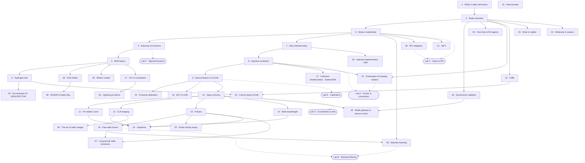

# Learning paths

The course is **41 chapters** plus a six-part **Maths Lab**. You don't have to read them in
order — most chapters need only a couple of earlier ones. This page shows the whole map, the
prerequisites, and a few **themed routes** so you can chart a path that fits your goal and your
hardware.

New here? The quickest start is still **Part I in order** (Chapters 1 → 2 → 3); everything else
branches off that foundation.

## The whole course at a glance

Arrows mean *"builds on"*. Dashed arrows point to the **Maths Lab** appendix that does the worked
maths behind a chapter.

## Themed routes

Pick the track that matches your goal. Each is an **ordered** list — follow it top to bottom.

### 🛋️ Laptop-only (no hardware, fully offline)

Every chapter runs on synthetic or archival data, so this is the complete course minus the
capture steps. **1 → 2 → 3 → 4 → 7 → 8 → 9 → 10 → 11 → 12 → 13 → 14 → 18 → 20 → 22 → 24 → 15.**
The Maths Lab (A–F) supports any of these whenever the maths gets dense.

### 📡 I have an RTL-SDR (hands-on hardware)

Build up to capturing real signals, then branch into the amateur projects. **1 → 2 → 3 → 4 → 5 →
6 → 29 → 28 → 30 → 26 → 27.** (Chapters 5–6 are the capture core; 26–30 are the project chapters.)

### 🛰️ Interferometry & imaging

The aperture-synthesis spine and where it leads. **3 → 7 → 8 → 9 → 17 → 19 → 25 → 37 → 12.**
Pair with **Lab A** (Fourier) and **Lab E** (calibration). Chapter 37 (polarisation &
Faraday rotation) reuses the same Fourier machinery in $\lambda^2$ space.

### ⏱️ Pulsars, transients & the nanohertz sky

Time-domain radio astronomy end to end. **3 → 10 → 13 → 18 → 20 → 38.** Pair with **Lab B**
(matched filtering / detection) and **Lab D** (coordinates & time). Chapter 38 pits a learned
classifier against the Lab B matched filter on the FRBs from Chapter 18.

### 🔭 Just the physics & maths

Skip the instruments; concentrate on the science and the derivations. **1 → 2 → 3 → 22 → 24 → 21**,
threaded with the whole **Maths Lab** (A → B → C → D → E → F).

## Maths Lab — which lab serves which chapter

The six appendices are the worked maths behind the course. Reach for one when a chapter leans on a
technique you'd like to see derived from scratch.

| Maths Lab | Worked technique | Most useful for |
|---|---|---|
| **[A · Fourier & convolution](notebooks/31_mathslab_fourier_convolution.ipynb)** | FT pairs, convolution theorem, sampling | Ch 8 (uv-plane), Ch 9 (CLEAN), Ch 37 (RM synthesis), Ch 42 (21 cm power spectrum), Ch 3 |
| **[B · Matched filtering](notebooks/32_mathslab_matched_filtering.ipynb)** | Detection theory, the matched filter | Ch 18 (FRBs), Ch 13 (pulsars), Ch 38 (ML baseline), Ch 3 |
| **[C · Noise & RFI](notebooks/33_mathslab_noise_rfi.ipynb)** | Noise statistics, robust RFI excision | Ch 3 (radiometer), Ch 39 (RFI flagging), Ch 5 (SDR) |
| **[D · Coordinates & time](notebooks/34_mathslab_coordinates_time.ipynb)** | Sky coordinates, time systems | Ch 10 (archives), Ch 11, Ch 13 |
| **[E · Calibration](notebooks/35_mathslab_calibration.ipynb)** | Linear algebra for gain/closure | Ch 41 (practical calibration), Ch 9 (CLEAN), Ch 12 (VLA imaging) |
| **[F · Special functions & beams](notebooks/36_mathslab_special_functions.ipynb)** | Bessel/sinc, beam patterns | Ch 4 (antennas), Ch 8 |

---

Prefer pictures? The **[Visual Tour](visual-tour.md)** walks the same material as diagrams, plots,
photographs, and videos. When you're ready, head to **[Setup](setup.md)** and open Chapter 1.
