# A Visual Tour

Some ideas land faster as a picture than a paragraph. This page is for visual learners: it
gathers **diagrams** of how the pieces fit together, **plots** that make the maths tangible,
**photographs** from the field, and **videos** to watch. Everything here is cross-linked to the
chapter where you can dig in.

---

## How it all fits together

These diagrams render live in your browser (Mermaid), so they stay crisp at any zoom.

### The radio signal chain

From a faint cosmic whisper to a number on your screen — the path every radio telescope shares.

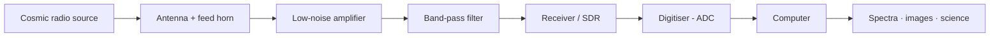

The amplifier comes *first* because it sets the noise floor; the filter tames strong
out-of-band signals that would swamp an 8-bit SDR. See
[Chapter 4](notebooks/04_antennas_and_receivers.ipynb) and
[Chapter 5](notebooks/05_sdr_basics.ipynb).

### The interferometry & imaging pipeline

How an array of dishes becomes an image — the subject of
[Chapters 7–9](notebooks/08_aperture_synthesis.ipynb).

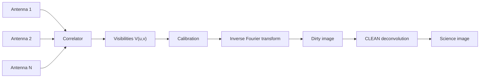

### The CLEAN loop

Högbom's algorithm ([Chapter 9](notebooks/09_deconvolution_clean.ipynb)), as a flowchart.

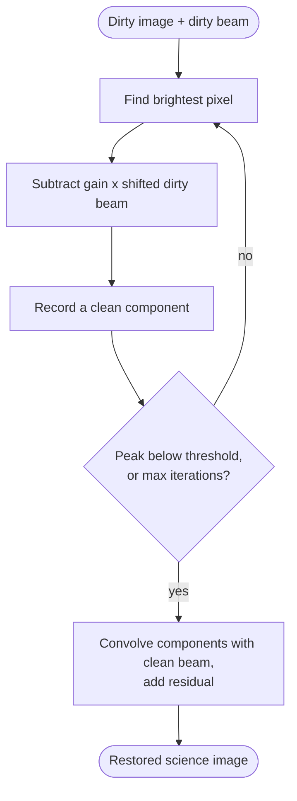

### From the hydrogen line to dark matter

The logical chain behind [Chapter 11](notebooks/11_hi_rotation_curve.ipynb).

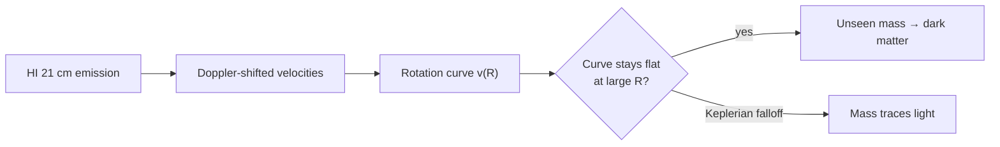

---

## The maths, made visual

These figures are generated from the `jansky` helper package by
[`scripts/generate_figures.py`](https://github.com/joebarbere/jansky/blob/main/scripts/generate_figures.py)
(Seaborn + the same code the chapters use), so they stay honest to the equations.

### The radiometer equation, as a heatmap

Sensitivity improves as $\sqrt{B\,\tau}$ — more bandwidth *and* more time both help. Read off
how faint a signal you can reach. ([Chapter 3](notebooks/03_signals_noise_radiometer.ipynb))

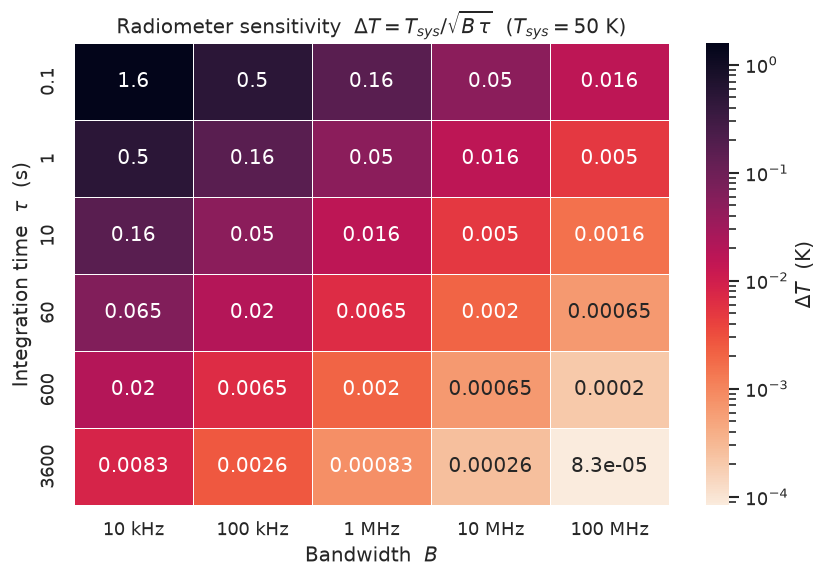

### Watching a signal climb out of the noise

Forty simulated integrations (95% band) converging on a faint 0.05 K source as you integrate
down. ([Chapter 3](notebooks/03_signals_noise_radiometer.ipynb))

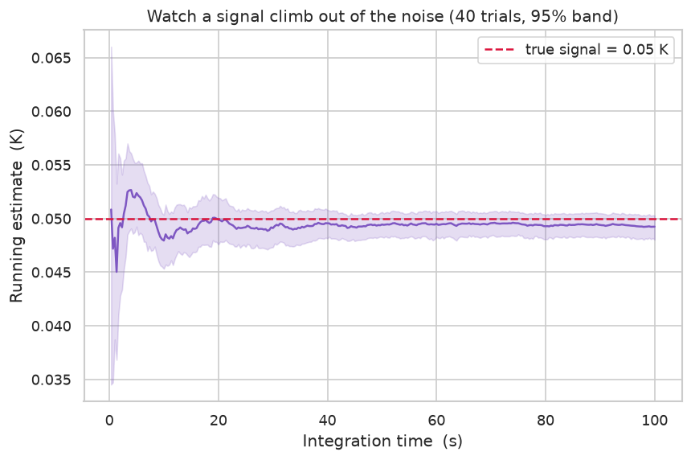

### Spectral index: thermal vs synchrotron

A two-component radio spectrum on log–log axes, with the power-law index recovered by fitting.
([Chapter 2](notebooks/02_physics_of_radio_emission.ipynb))

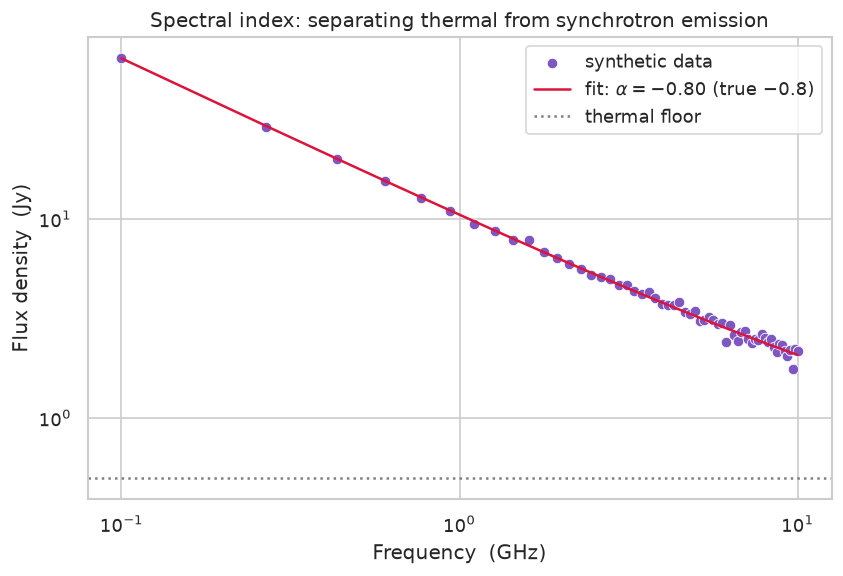

### Brightness temperature → flux density

The Rayleigh–Jeans law made tangible: how kelvin map to janskys across the radio band.
([Chapter 2](notebooks/02_physics_of_radio_emission.ipynb))

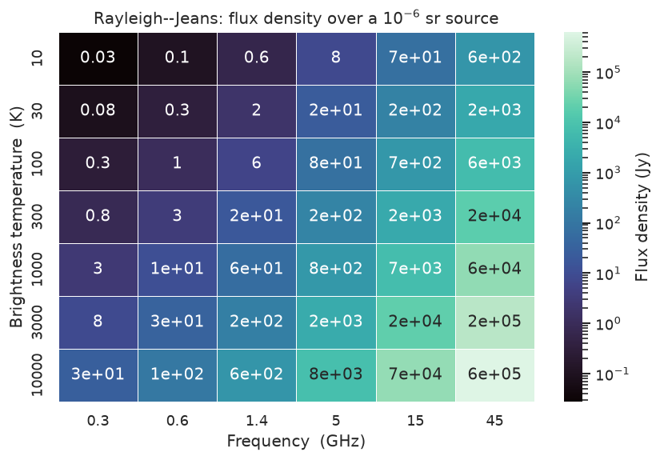

### Antenna beam patterns

The main lobe and its sidelobes for a uniform dish (Airy) vs a tapered (Gaussian) illumination,
in decibels. ([Chapter 4](notebooks/04_antennas_and_receivers.ipynb))

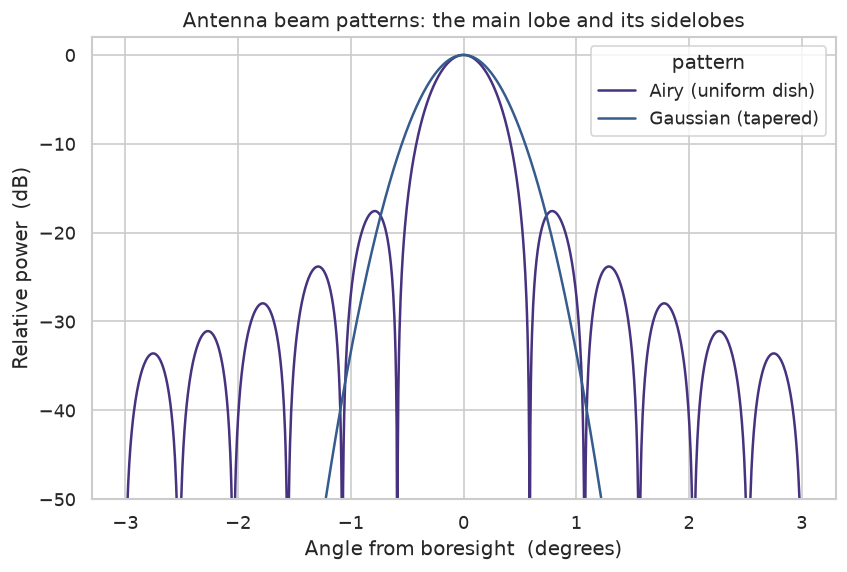

### Filling the uv-plane

Why a snapshot isn't enough: Earth rotation sweeps each baseline into an arc, filling the
Fourier plane. ([Chapter 8](notebooks/08_aperture_synthesis.ipynb))

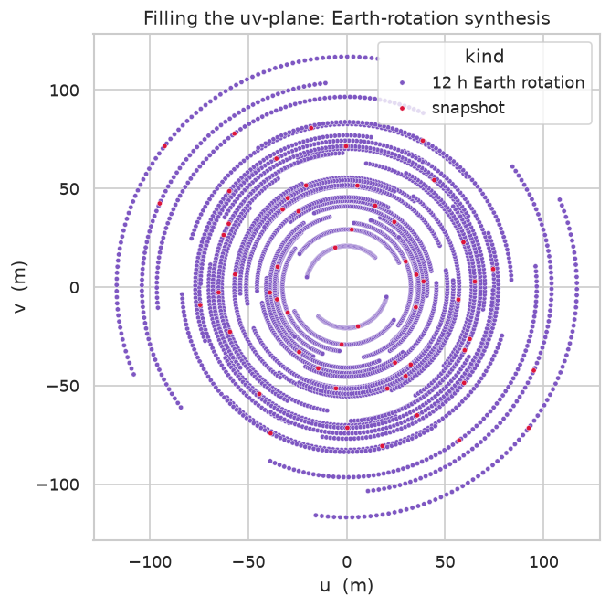

### The pulsar P–Ṗ diagram

The radio astronomer's "HR diagram": spin period vs its derivative, with characteristic-age
lines. Note the separate millisecond-pulsar population. *(Illustrative populations.)*
([Chapter 13](notebooks/13_pulsars.ipynb))

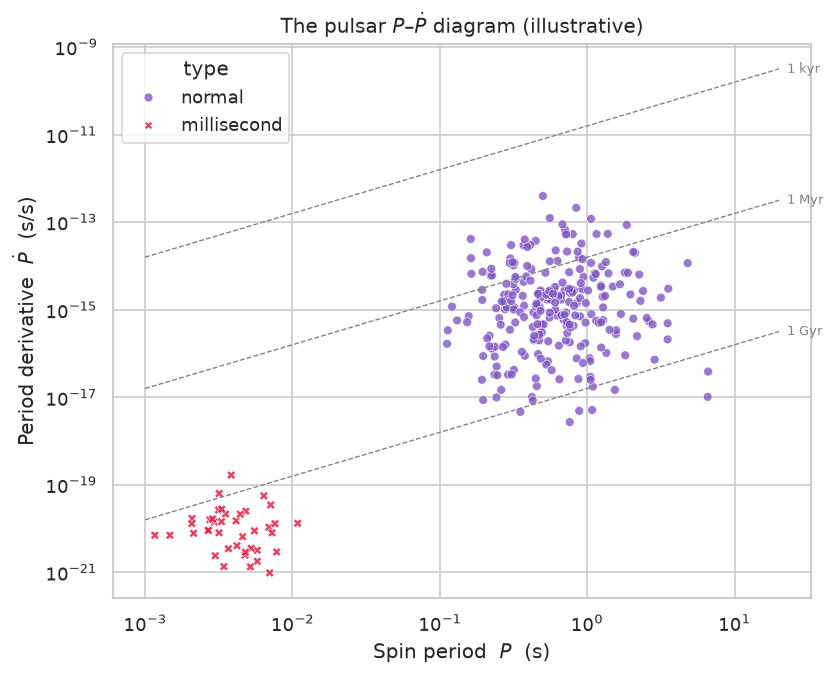

### Infographic: why we build big arrays

Angular resolution scales as $1.22\,\lambda/D$ — so a planet-sized array (VLBI/EHT) sees a
*million* times finer than a backyard dish.

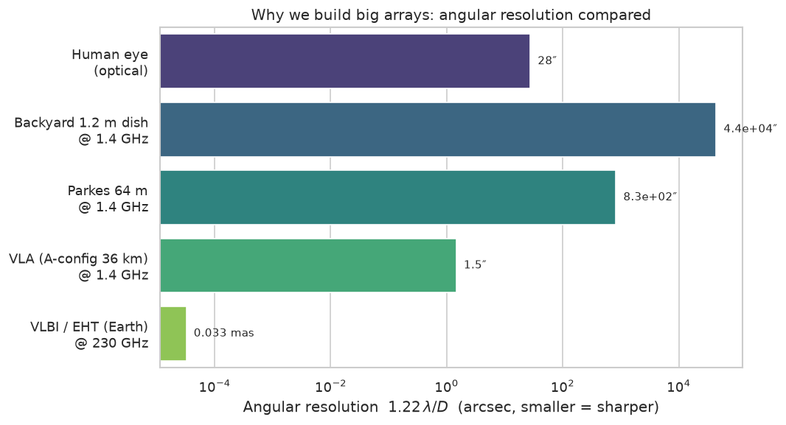

---

## Pictures from the field

A short photographic history, from a backyard in the 1930s to a planet-sized telescope.
All images are public domain or Creative Commons; credits below each.

{ width="49%" }
{ width="36%" }

*Left: full-size replica of **Karl Jansky's** rotating "merry-go-round" array (the
[antenna](https://commons.wikimedia.org/wiki/File:Janksy_Karl_radio_telescope.jpg) that started
it all), public domain. Right: **Grote Reber's** 1937 backyard dish, the first parabolic radio
telescope ([source](https://commons.wikimedia.org/wiki/File:Grote_Antenna_Wheaton.gif),
public domain).*

{ width="49%" }
{ width="49%" }

*Left: the **Karl G. Jansky Very Large Array** (VLA), New Mexico — John Fowler, CC BY 2.0.
Right: **ALMA** antennas at 5,000 m on Chajnantor — ESO/José Francisco Salgado, CC BY 4.0.*

{ width="40%" }
{ width="49%" }

*Left: the **Event Horizon Telescope's** image of the M87\* black hole — assembled by
radio interferometry across the planet (EHT Collaboration / ESO, CC BY 4.0). Right: the
**Arecibo** 305 m dish — H. Schweiker/WIYN and NOAO/AURA/NSF, CC BY 4.0.*

{ width="40%" }

*A satellite **LNB** (low-noise block) — the same cheap feed-plus-amplifier hardware amateurs
repurpose for hydrogen-line and 11 GHz builds (see [Projects](projects.md)). Laurent06, CC BY-SA 3.0.*

---

## Watch & learn

A hand-picked few to get started — click a thumbnail to watch on YouTube. For the **full
library** of channels and videos organised by topic, see [Watch on YouTube](videos.md).

### Foundations

- **Beyond the Visible** (NSF/NRAO, narrated by Jodie Foster) — a polished orientation to the VLA and what radio astronomy is for.
- **Jansky Lecture 1975: The Beginning of Radio Astronomy** (NRAO) — Grote Reber, who built the first dish, narrating the field's origins.

### Instruments & interferometry

- **Jodrell Bank: the story of the Lovell Telescope** — single-dish history and engineering.
- **How to take a picture of a black hole** (Katie Bouman, TED) — the aperture-synthesis pipeline behind the EHT; perfect for [Chapters 8–9](notebooks/08_aperture_synthesis.ipynb).

### Objects & discoveries

- **The Discovery of Pulsars: A Graduate Student's Tale** — Dame Jocelyn Bell Burnell's own account; pairs with [Chapter 13](notebooks/13_pulsars.ipynb).
- **First Image of a Black Hole** (Veritasium) — the result the interferometry chapters build toward.
- **Pulsar Starquakes Make Fast Radio Bursts?** (PBS Space Time) — the FRB frontier.

### Build it yourself

- **Observing the 21 cm hydrogen line with a DIY radio telescope** — a homemade horn + SDR detecting galactic hydrogen; see [Projects, Kits & Hacks](projects.md).

---

*Diagrams and plots in this course are open — regenerate the figures any time with
`uv run python scripts/generate_figures.py`. For the science behind them, follow the chapter
links or see the [References](references.md).*
